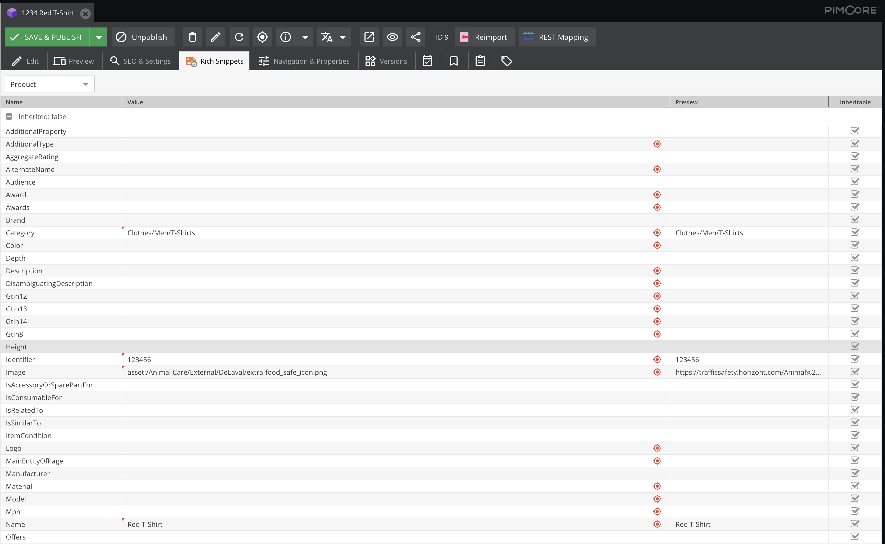

# Rich Snippets / Microdata Bundle

## Configuration



This Pimcore plugin adds a microdata tab in the edit view for documents, assets and data objects. After selecting one of the types specified by [Schema.org](https://schema.org/) you can enter the data for all the fields which the Schema.org standard defines for the selected type.

Beside direct input (click on `Value` cell) you can use drag and drop to assign objects and assets. Additionally you can enter a callback function by clicking in the `Preview` cell. This callback function supports the following variables as input:

* `$value`: The value which got entered in the cell `Value`
* `$element`: contains the current element. With this you can directly refer to a certain data object field

Example:

```php
return $element->getName();
```

You can also inherit microdata items to elements below the current one. If this is undesired, mark the item as not inheritable (remove checkmark in `inheritable` column).

## Output rich snippet data

To include microdata JSON-LD in output, write the following code on the wanted position:

```Twig
{{ render(controller(
     'BlackbitRichSnippetsBundle:Output:getJSON',
     { 'element': document }
 )) }}
```

`document` is the `\Pimcore\Model\Document\Page` object in this case. For parameter `element` you can also provide an asset or a data object.

Alternatively you can call the output with element type and id:

```Twig
{{ render(controller(
     'BlackbitRichSnippetsBundle:Output:getJSON',
     { 'elementId': productId, 'elementType': 'object' }
 )) }}
```

## How to get the plugin

Please write an email to [info@blackbit.de](mailto:info@blackbit.de).